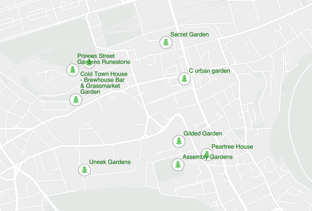

# Places service demo

This example application was created to accompany the [Using Raw REST Requests to Leverage the Places Service with the ArcGIS Maps SDK for Native Apps](https://www.esri.com/arcgis-blog/developers/) blog, and shows users of the ArcGIS Maps SDK for Native Apps how to use the Places and Basemap Services in their applications.

## How to use this example

Run the example code to view the basemap (created from [basemap styles service v2](https://developers.arcgis.com/rest/basemap-styles/)) and see the results of a [places service](https://developers.arcgis.com/documentation/mapping-apis-and-services/places/) request for gardens in central Edinburgh . Pan and zoom to navigate the map.

## Accessing Esri location services with an API key
Accessing Esri location services, including basemaps, routing, and geocoding within this app requires authentication with an API Key:

**API key**: A permanent key that gives your application access to Esri location services. Visit your [ArcGIS Developers](https://developers.arcgis.com/documentation/mapping-apis-and-services/get-started/) Dashboard to create a new API key or access an existing API key.

**Note**: in the following instructions for setting the API key, if a gradle.properties file does not already exist in the /.gradle folder within your home directory, a Gradle task in the samples build.gradle file will generate one for you.

### IntelliJ IDEA
1. Open IntelliJ IDEA and select File > Open....
2. Choose one of the sample project directories (not the category folder) and click OK.
3. Select File > Project Structure... and ensure that the Project SDK and language level are set to use Java 11 or Java 17.
4. Store your API key in the gradle.properties file located in the /.gradle folder within your home directory. The API key will be set as a Java system property when the sample is run.
5. Open the Gradle view with View > Tool Windows > Gradle.
6. In the Gradle view, double-click the run task under Tasks > application to run the app.

Note: if you encounter the error Could not get unknown property 'apiKey' for task ':run' of type org.gradle.api.tasks.JavaExec. you may have to set the Gradle user home in the IntelliJ Gradle settings to the /.gradle folder in your home directory.
